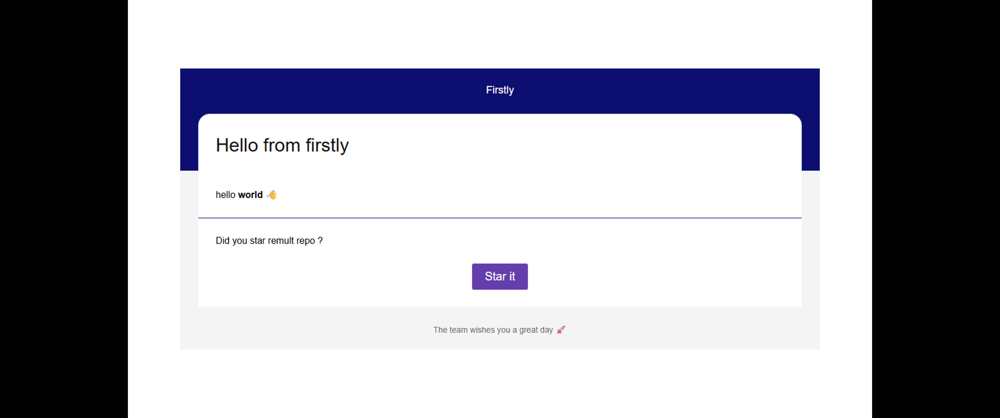
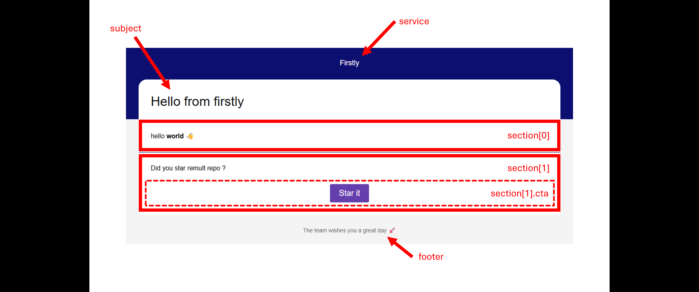

import { Aside } from '@astrojs/starlight/components'

To it's core, `firstly` provides you the ability to send emails. For this, we didn't reinvent the
wheel and use the great [nodemailer](https://nodemailer.com/) package.

Once you have it setup, assign you the role `"Mail.Admin"` _(You can get it via
`Roles_Mail.Mail_Admin`)_, and in Admin UI, you will be able to see all mails in the entity named
`FF Mails`.

## Installation

```bash
npm add firstly@latest -D
```

## Setup

```ts
// src/server/api.ts
import { mail } from 'firstly/mail/server'

export const api = remultApi({
	modules: [mail()],
})
```

## Usage

Anywhere in your code you can then:

```ts
import { remult } from 'remult'

await remult.context.sendMail('my_first_mail', {
	to: 'hello@example.com',
	subject: 'Hello from firstly',
	sections: [
		{ html: 'hello <b>world</b> 👋' },
		{
			html: 'Did you star remult repo ?',
			cta: { html: 'Star it', link: 'https://github.com/remult/remult' },
		},
	],
})
```

The result will be something like this:



You can see the structure of the mail in the following image:



<Aside type="note">
	By default, firstly will create a demo account on [ethereal.email](https://ethereal.email/), this
	will **NEVER** send a real email, but you can see the email sent in the ethereal dashboard. You
	also get a link to the email preview in the console.
</Aside>

## Manually configure your service

Configure the `transport` of your email service.

```ts
export const api = remultApi({
	modules: [
		mail({
			nodemailer: {
				transport: {
					host: '...',
					port: 587,
					secure: false, // Use `true` for port 465, `false` for all other ports
					auth: {
						user: '...',
						pass: '...',
					},
				},
			},
		}),
	],
})
```

## Send via Resend

[Resend](https://resend.com) speaks SMTP, so it drops in as a regular nodemailer
transport. Sign up, verify your sending domain (Resend gives you the SPF / DKIM /
DMARC DNS records to paste into your registrar), grab an API key, then:

```ts
// Load RESEND_API_KEY from your framework's env helper:
//   SvelteKit:   import { RESEND_API_KEY } from '$env/static/private'
//   Next / Node: const RESEND_API_KEY = process.env.RESEND_API_KEY!

export const api = remultApi({
	modules: [
		mail({
			from: { name: 'My Cool App', address: 'noreply@mycoolapp.com' },
			nodemailer: {
				transport: {
					host: 'smtp.resend.com',
					port: 465,
					secure: true,
					auth: {
						user: 'resend', // literal string, not your account email
						pass: RESEND_API_KEY,
					},
				},
			},
		}),
	],
})
```

<Aside type="tip">
	After every send, firstly persists nodemailer's response (`messageId`, `response`, `accepted`,
	`rejected`, `envelope`) into `Mail.metadata.transport`. The Resend dashboard ID arrives via SMTP as
	the `messageId`, so you can recover it from the DB without calling Resend back.
</Aside>

## Global params

Global params are applied to all mails by default and can be overridden for each mail _(handy!)_

```ts
export const api = remultApi({
	modules: [
		mail({
			service: 'Cool App',
			footer: `Thank you for using Cool App`,
			// primaryColor: '#000000',
			// secondaryColor: '#000000',
			// toHtml(mailInfo) => `` // You can override the html of the mail
			from: {
				name: 'My Cool App',
				address: 'noreply@coolApp.com',
			},
		}),
	],
})
```
